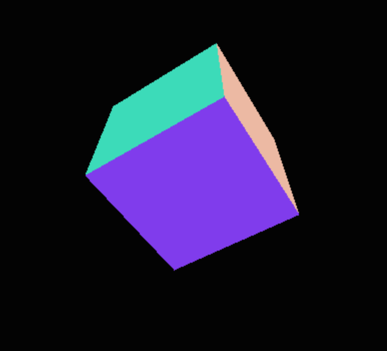

# Spinning Cube

This is my first attempt at 3D computer graphics using WebGL and the Three.js library. I decided to create it as a fun project at the weekend just to see what can be done with web graphics.

## Screenshot
<div align="center">
  
</div>

## To Run
```
$ git clone https://github.com/katebeavis/spinning-cube-three-js.git
$ cd spinning-cube-three-js
$ open index.html
```
